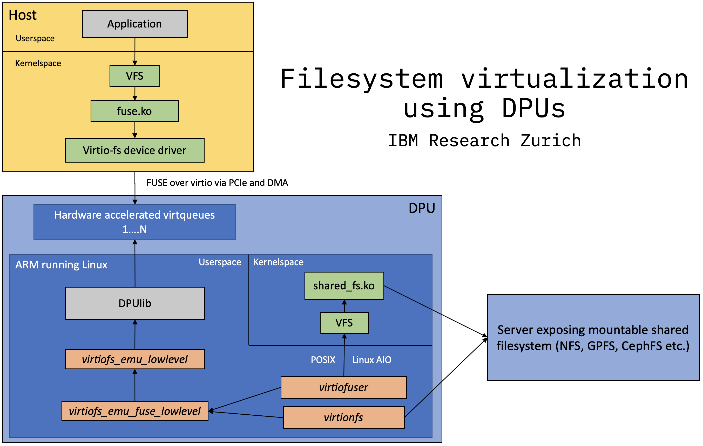

# Filesystem Virtualization using DPUs
A DPU (Data Processing Unit), for the scope and definition of this project, contains a CPU (running e.g. Linux), NIC and programmable data acceleration engines. It is also commonly referred to as SmartNIC or IPU (Infrastructure Processing Unit).

DPUs are shaping up to be the center of virtualization in the Hyperconverged Infrastructure (HCI).
[Virtio](https://developer.ibm.com/articles/l-virtio) is an abstraction layer for virtualized environments to expose virtual PCIe hardware to guest VMs.
[Virtio-fs](https://www.kernel.org/doc/html/latest/filesystems/virtiofs.html) is one of these virtual PCIe hardware specifications. It employs the [FUSE](https://www.kernel.org/doc/html/latest/filesystems/fuse.html) protocol (only the communication protocol!) to provide a filesystem to guest VMs.
There are now DPUs comming out on the market that have support for hardware-accelerated virtio-fs emulation. Thereby having a real hardware device implement the virtual filesystem layer of virtio.

# Implementation

## Modules
This project uses a specific DPU library for the virtio-fs emulation layer, but is generalizable to other DPUs.
### `virtiofs_emu_lowlevel`
Front-end for the virtio-fs emulation layer. Only useable if steps in *Usage* are taken.
### `virtiofs_emu_fuse_lowlevel`
Provides a lowlevel FUSE API (close-ish compatible fork of `libfuse/fuse_lowlevel.h`) over the raw buffers that DPUlib provides the user, using `virtiofs_emu_lowlevel`.
### `virtiofuser`
Reflects a local filesystem via the POSIX FS API by implementing the lowlevel FUSE API in `virtiofs_emu_fuse_lowlevel`, with synchronous reads and writes. Basic use of the operations works. Full rocksdb benching doesn't work yet.
### `virtiofuser`
Reflects a local filesystem via the POSIX FS API by implementing the lowlevel FUSE API in `virtiofs_emu_fuse_lowlevel`, with asynchronous reads and writes using Linux AIO systemcalls. Not fully tested.
### `virtionfs`
Reflects a NFS folder with the asynchronous userspace NFS library `libnfs` by implementing the lowlevel FUSE API in `virtiofs_emu_fuse_lowlevel`. Current work in progress. The Linux fuse implementation's FUSE:init timeout is too short for the full NFS connect handshake (RPC connect, setting clientid and resolving the filehandle of the export path), so wait for `virtionfs` to report that the handshake is done before starting a workload!
### `list_emulation_managers`
Standalone program to find out which RDMA devices have emulation capabilities

## TODO
- [ ] `virtionfs` full implementation, only a proof of concept at the moment
- [ ] `virtionfs` fully implement random verifier and clientid
- [ ] `virtionfs` fix init completing before NFS handshake is done

# Usage
* Enable virtio-fs emulation in the DPU firmware with atleast one physical function (PF) for virtio-fs, and reboot the DPU
* Determine the RDMA device that has virtio-fs emulation capabilities by running `list_emulation_managers`
* Use `virtiofuser`, `virtiofuser_aio` or `virtionfs` by specifying the correct physical function (PF) with `-p`, virtual function (VF) zero `-v 0` and the RDMA device name that has virtio-fs emulation capabilities with `-e`

## :switzerland: Cloud Data Platforms group at IBM Research Zurich
