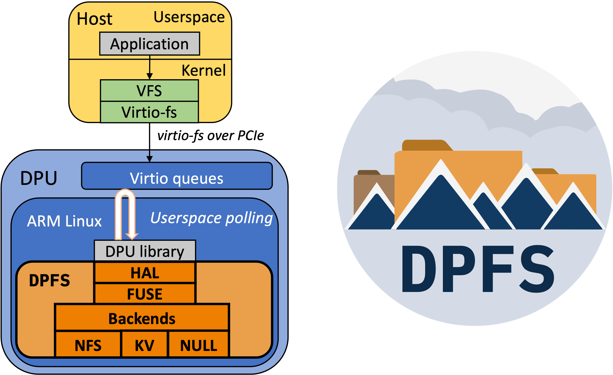

# DPFS - **D**PU-**P**owered **F**ile **S**ystem Virtualization framework
The DPFS framework allows Cloud and datacenter operators to provide virtualized file system services to tenants using DPU-offloading.
With DPFS the complete file system implementation runs on the CPU complex of the DPU. Tenants consume the file system through the `virtio-fs` device that the DPU exposes over PCIe (multi-tenancy via SR-IOV).
DPFS provides a hardware abstraction layer, FUSE API implementation and several file system implementations.

## Research Publications
* [ACM SYSTOR '23 conference (preprint)](DPFS_systor23_preprint.pdf)!
* OpenFabrics Alliance Workshop '23 presentation ([slidedeck](https://www.openfabrics.org/wp-content/uploads/2023-workshop/2023-workshop-presentations/day-3/303_PGootzen.pdf), [presentation recording](https://youtu.be/2cTxELxCG_g))
* CHEOPS Workshop at EuroSys '23 presentation (slides coming soon)

# Design and implementation

## Modules
### `dpfs_hal`
Front-end and hardware abstraction layer for the virtio-fs emulation layer of the DPU hardware. Currently only supports the Nvidia BlueField-2, support for other vendors is in the works.
We have worked together with other DPU vendors to make sure our framework architecture/API is compatible with future virtio-fs support for other DPUs.

### `dpfs_fuse`
Provides a lowlevel FUSE API (close-ish compatible fork of `libfuse/fuse_lowlevel.h`) over the raw buffers that DPUlib provides the user, using `dpfs_hal`. If you are building a DPU file system, use this library.

### `dpfs_nfs`
Reflects a NFS folder with the asynchronous userspace NFS library `libnfs` by implementing the lowlevel FUSE API in `dpfs_hal`. The full NFS connect handshake (RPC connect, setting clientid and resolving the filehandle of the export path) is currently implemented asynchronously, so wait for `dpfs_fuse` to report that the handshake is done before starting a workload!

The NFS server needs to support NFS 4.1 or greater!
Since the current release version of `libnfs` does not fully implement NFS 4.1 yet (+ no polling timeout), [this new version of `libnfs`](https://github.com/sahlberg/libnfs/commit/7e91d041c74ee33f48fc81465aa97d6610772890) is needed, which implements the missing functionality we need.

### `dpfs_kv`
Reflects the contents of a RAMCloud cluster as a flat root directory to the host machine. The key is the name of the file in the root directory and the value is the contents (4k max file size) of the file. This backend is optimized for low latency for many small files through RDMA.

### `dpfs_aio`
Reflects the contents of a file system that is mounted locally on the DPU, metadata operations are synchronous and R/W I/O are asynchronously performed using `libaio`

### `dpfs_uring`
Same as `dpfs_aio` but the R/W I/O uses `io_uring`. See the conf_example.toml for extra io_uring options.

### `list_emulation_managers`
Standalone program to find out which RDMA devices have emulation capabilities

# Usage on the Nvidia BlueField-2
The Nvidia SNAP library that is needed to run on BlueField-2 (only DPU currently supported) is closed source and does require a patch to enable asynchronous request completion.
Using `virtio-fs` in SNAP is currently only possible with a prototype firmware and some alterations to the SNAP library. You can reach out to us on how to integrate DPFS and SNAP.

With the above in mind, the rough steps needed to run DPFS on the BlueField-2:
* Patch SNAP to add a virtio-fs device type called "virtiofs_emu"
* Patch SNAP to support asynchronous completion of virtio-fs requests (needs to be concurrency-safe)
* Integrate DPFS into the build system of SNAP
* Enable virtio-fs emulation in the DPU firmware with atleast one physical function (PF) for virtio-fs, and reboot the DPU
* Determine the RDMA device that has virtio-fs emulation capabilities by running `list_emulation_managers`
* Use one of the file system implementations by configuring DPFS through the toml configuration file (see `conf_example.toml`)

# Project status
See the Github issues and milestones.

# FAQ
## What is a 'DPU'?
A DPU (Data Processing Unit), for the scope and definition of this project, contains a CPU (running e.g. Linux), NIC and programmable data acceleration engines. It is also commonly referred to as SmartNIC or IPU (Infrastructure Processing Unit).

DPUs are shaping up to be(come) the center of virtualization in the Cloud. By offloading cloud operator services such as storage, networking and cloud orchestration to the DPU,
the load on the host CPU is reduced, cloud operators have more control over their services (for upgrades and performance optimizations) and bare metal tenants are easier to support.

## What is `virtio-fs`?
[Virtio](https://developer.ibm.com/articles/l-virtio) is an abstraction layer for virtualized environments to expose virtual PCIe hardware to guest VMs.
[Virtio-fs](https://www.kernel.org/doc/html/latest/filesystems/virtiofs.html) is one of these virtual PCIe hardware specifications.
It employs the [FUSE](https://www.kernel.org/doc/html/latest/filesystems/fuse.html) protocol (only the communication protocol!) to provide a filesystem to guest VMs.
There are now DPUs comming out on the market that have support for hardware-accelerated virtio-fs emulation. Thereby having a real hardware device implement the virtual filesystem layer of virtio.
We are using the Nvidia BlueField-2 which has support for virtio-fs emulation using Nvidia SNAP (Currently only available as a limited technical feature preview).

## :switzerland: Hybrid Cloud / Infrastructure Software group at IBM Research Zurich
For contact about DPFS and the research we are conducting please reach out to: Peter.Jan.Gootzen at ibm d0t c0m. If you are a DPU-vendor looking into support file system offloading on your DPU, we would be happy to help with porting DPFS to your hardware.
